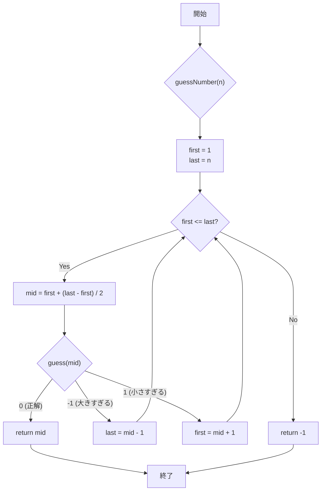

# Binary Search Algorithm
### Problem
- https://leetcode.com/problems/guess-number-higher-or-lower/description/?envType=study-plan-v2&envId=leetcode-75

### Flowchart


### Implementation
```java
  static int guessNumber(int n) {
    var left = 1;
    var right = n;
    while (left <= right) {
      var mid = left + (right - left) / 2;
      var res = guess(mid);
      if (res == 0) {
        return mid;
      } else if (res == 1) {
        // n < pick
        left = mid + 1; // 探索対象からmidを除外するために+1する
      } else if (res == -1) {
        // pick < n
        right = mid - 1;// 探索対象からmidを除外するために−1する
      }
      n = (int) Math.floor((right - left) / 2);
      res = guess(n);
    }
    return 0;
  }

  /**
   * Forward declaration of guess API.
   * 
   * @param num your guess
   * @return -1 if num is higher than the picked number
   *         1 if num is lower than the picked number
   *         otherwise return 0
   *         int guess(int num);
   */
```