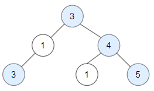
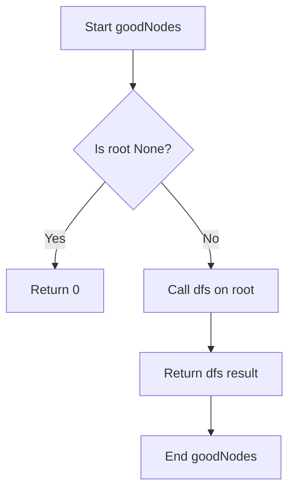
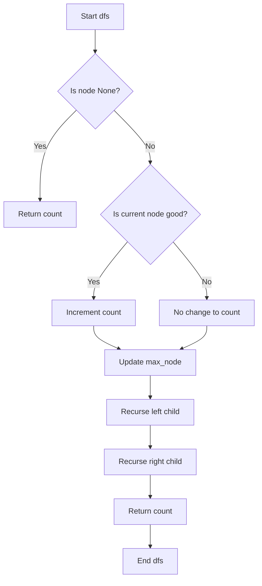

# DFS: Depth First Search
[1448. Count Good Nodes in Binary Tree](https://leetcode.com/problems/count-good-nodes-in-binary-tree/description/?envType=study-plan-v2&envId=leetcode-75)
<br>

```py
# Definition for a binary tree node.
class TreeNode:
    def __init__(self, val=0, left=None, right=None):
        self.val = val
        self.left = left
        self.right = right

class Solution:
    def dfs(self, node: TreeNode, count: int, max_node: int) -> int:
        if node == None:
            return count
        
        if max_node <= node.val:
            count += 1
        
        max_node = max(max_node, node.val)
        count = self.dfs(node.left, count, max_node)
        count = self.dfs(node.right, count, max_node)

        return count
    
    def goodNodes(self, root: TreeNode) -> int:
        return self.dfs(root, 0, root.val)

if __name__ == "__main__":
    sample1 = TreeNode(3, TreeNode(1, TreeNode(3), None), TreeNode(4, TreeNode(1), TreeNode(5)))
    sample2 = TreeNode(3, TreeNode(3, TreeNode(4), TreeNode(2)), None)
    sample3 = TreeNode(1)
    s = Solution()
    print(s.goodNodes(sample1))
    print(s.goodNodes(sample2))
    print(s.goodNodes(sample3))
```

### def goodNodes


### def dfs
