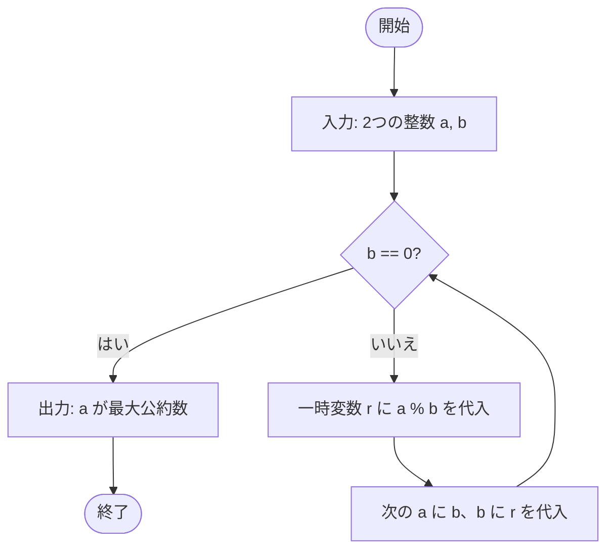

# ユークリッドの互除法の性質
```
A % B = Rの時、GCD(A, B) = GCD(B, R)である
```
# フロー


# 実装
### 再帰
```py
def GCD(A, B):
    if B == 0:
        return A
    else:
        return GCD(B, A % B)
```

### while
```py
def gcd(a, b):
    while b != 0:
        a, b = b, a % b
    return a
```