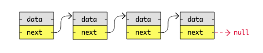

# LinkdedList/連結リスト

```python
class ListNode(object):
    def __init__(self, val=0, next=None):
        self.val = val
        self.next = next
```
- https://www.w3schools.com/dsa/dsa_theory_linkedlists.php
- dataとnextを持つクラスからなるリスト
- LinkedList vs Array
  - Array
    - 隣同士の連続したメモリ領域に保存される
    - 要素の追加・削除を実施した際に全要素のindexを更新する必要がある
  -  LinkedList
     - 各データはヒープメモリ上に動的に確保され、ポインタによって連結される
     - 要素の追加・削除時は直前の要素のポインタ(next)を書き換えるだけ
- Arrayの方が扱いやすいしわかりやすい。しかし億を超える単位のデータを扱う場合はLinkedListの方がパフォーマンスが良くなるケースが多い。