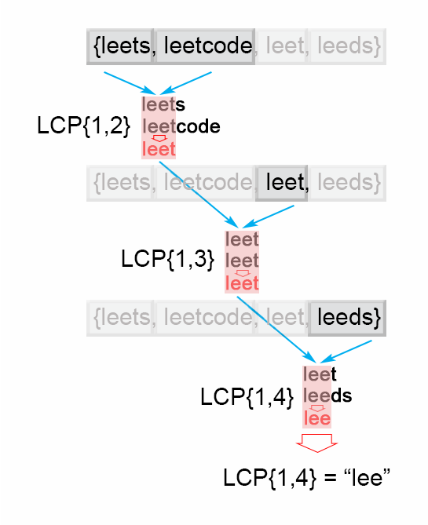

# Longest Common Prefix
```python
def lcp(s1, s2):
    longest_common_prefix = ""
    for i in range(min(len(s1), len(s2))):
        if s1[i] != s2[i]:
            break
        longest_common_prefix += s1[i]
    return longest_common_prefix
```
- 問題：https://leetcode.com/problems/longest-common-prefix/editorial/
- 実装：https://github.com/tttol/leetcode/blob/main/src/longest_common_prefix2.py
  - LCPの入れ子で計算していく。これが正攻法っぽい。
- 裏技実装：https://github.com/tttol/leetcode/blob/main/src/longest_common_prefix.py
  - 最小長と最大長の文字列を1回比較するだけで実は解けちゃう
- lcpメソッド・・・文字列が複数個格納された配列から最長の共通prefixを取得する
- `LCP(S1, …Sn) = LCP(LCP(LCP(S1, S2), S3), …Sn)`で導出される
